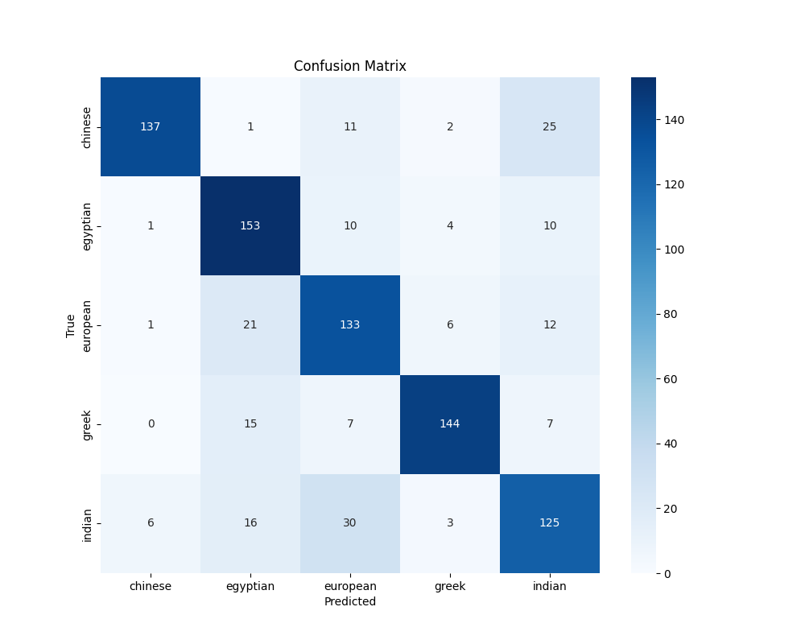

## Project Journal – Learning From Learning

This project started with a simple idea: build a model that can tell what kind of building it's looking at. But instead of relying on pre-trained networks or copying an existing approach, I wanted to see if I could create something from scratch — something that reflects how I think.

Along the way, I began to ask questions not about the data or the code, but about learning itself.

Why do we forget some things and hold on to others?
How do we decide what lessons matter?
What if a machine could do the same?

That's where the idea of a **replay buffer** came in — a way for the model to remember its most impactful examples from each training run. Not all the data. Just the moments that mattered. The ones that were either:
- extremely confident (proof it “got it right”)
- extremely wrong (proof it still had something to learn)

These are stored and replayed in future training sessions — like memory flashbacks. It's not about preventing forgetting. It's about remembering **with purpose**.

I didn’t write the implementation code from scratch. I used ChatGPT to help me shape and scaffold it. But the thinking, the structure, and the design — that’s mine.

It might be chaotic. It might not be formal. But it's real. And that's worth documenting.

---
## 🧠 Phase I — Binary Classifier (Residential vs Industrial)

### ✅ Goals:
- Build a model **from scratch using PyTorch**, no pre-trained models
- Classify between two building types: `residential` and `industrial`
- Set up full pipeline: dataset download, training, evaluation

### 🔧 Model Architecture
- `BuildingClassifier` — 3 conv layers + 2 FC layers
- Image input: 128x128 RGB
- Final layer uses `Sigmoid` for binary output

### 📦 Dataset
- Downloaded using `duckduckgo_search`
- ~500 images per category
- Images resized to 128x128 for training

### 🏋️‍♂️ Training Info
- **Epochs:** 10
- **Batch Size:** 32
- **Loss Function:** `BCELoss`
- **Optimizer:** Adam (lr=0.001)
- **Device:** CPU

### 📉 Training Loss Per Epoch
```
Epoch [1/10] Loss: 0.6982
Epoch [2/10] Loss: 0.6687
Epoch [3/10] Loss: 0.6002
Epoch [4/10] Loss: 0.5330
Epoch [5/10] Loss: 0.4943
Epoch [6/10] Loss: 0.4828
Epoch [7/10] Loss: 0.4481
Epoch [8/10] Loss: 0.4356
Epoch [9/10] Loss: 0.4163
Epoch [10/10] Loss: 0.3783
```

### ✅ Evaluation Results
- **Validation Accuracy:** `94.03%`

### 🧪 Observations:
- Model converged smoothly with no instability
- Accuracy above 90% on small custom dataset
- Promising baseline for expanding to multiclass and style-based classification

### 🛠️ Utilities Implemented:
- `save_model(model, path)`
- `plot_training_loss(loss_values)`
- `count_parameters(model)`

---

## 🔜 Next Phases
- [ ] Extend to multiclass (e.g. religious, commercial, ancient, etc.)
- [ ] Visualize predictions on single images
- [ ] Transition to cultural and stylistic classification (e.g. Gothic, Baroque)

---
## 🏗️ Phase 2: Multiclass Cultural Classification

### ✅ Training Overview
- **Model:** Custom CNN (`BuildingClassifier` with replay buffer)
- **Classes:** Chinese, Egyptian, European, Greek, Indian
- **Dataset:** ~880 images across 5 classes (post-split validation set)
- **Epochs:** 5
- **Replay Buffer:** Enabled – 10 best + 10 worst samples per epoch

### 📉 Training Loss (5 Epochs)
- Epoch 1: Loss = 1.4967
- Epoch 2: Loss = 1.2377
- Epoch 3: Loss = 1.0624
- Epoch 4: Loss = 0.9311
- Epoch 5: Loss = 0.7879


---

### 🧪 Evaluation Results
- **Overall Accuracy:** 78.64%

#### 📊 Per-Class Performance
| Class     | Precision | Recall | F1-score |
|-----------|-----------|--------|----------|
| Chinese   | 0.94      | 0.78   | 0.85     |
| Egyptian  | 0.74      | 0.86   | 0.80     |
| European  | 0.70      | 0.77   | 0.73     |
| Greek     | 0.91      | 0.83   | 0.87     |
| Indian    | 0.70      | 0.69   | 0.70     |



### 🔍 Observations
- Model performs strongest on **Greek** and **Chinese** classes
- **Indian** class had lowest F1 — may benefit from more data or contrastive samples
- Replay buffer likely helped maintain stable improvements each epoch

---

### 🔄 Next Steps
- Increase epoch count to 10–15
- Explore data augmentation (lighting, perspective)
- Begin Phase 3: Style classification (Baroque, Gothic, etc.)

## Appendix: The Original Thought That Sparked the Replay Buffer

I’m keeping this here because it’s how the idea first came to me. It wasn’t academic or clean. It was just me thinking aloud:

> *“Well yeah. I mean I'm not a programming engineer, but I guess it should be possible to save some kind of reference point after each training along with something like I don't know... 10-20 datapoints that gave the most accuracy during training or helped the most or smth and when later updating the training use it as a sort of ‘yeah this IS old data, but it is a chair or house as well just as accurate than the new data’.  
>  
> Or save the best and worst and add it again to the new training dataset.  
>  
> I mean that's sort of how humans work too. Take what's working, keep updating, but sometimes despite all your new insights and evolved methods you still can't solve the problem and that's when you think back to the beginning of your journey and go like ‘waaaait a minute... I used to be able to solve this thing this way too, I know it's very archaic, but let's try it’ and boom, solved.”*

This wasn’t written for anyone but me, but I’m keeping it here to show that original ideas don’t always come in clean lines. Sometimes they come in half-sentences and “or smth” — and that’s okay.

This is where the replay buffer idea came from. This was the seed.

---

## Next Steps: Evolution of Classification

This project will move beyond binary classification and into multi-class cultural and stylistic detection.

I plan to expand it in two phases:

### 1. Cultural Classification
Identify architectural origin from full images:
- Egyptian
- Greek
- Roman
- Chinese
- Islamic
- Medieval European
- Modern Western

### 2. Style Recognition Within Cultures
Drill down into styles like:
- Renaissance, Baroque, Gothic, Brutalist
- Ming vs Tang (Chinese)
- Persian vs Moorish (Islamic)

This mirrors how architectural history is taught: understand the **culture**, then the **evolution of its expression**.

And that’s the direction I’m building toward — a model that doesn’t just see *what a building is*, but understands *where it comes from* and *why it looks the way it does*.
