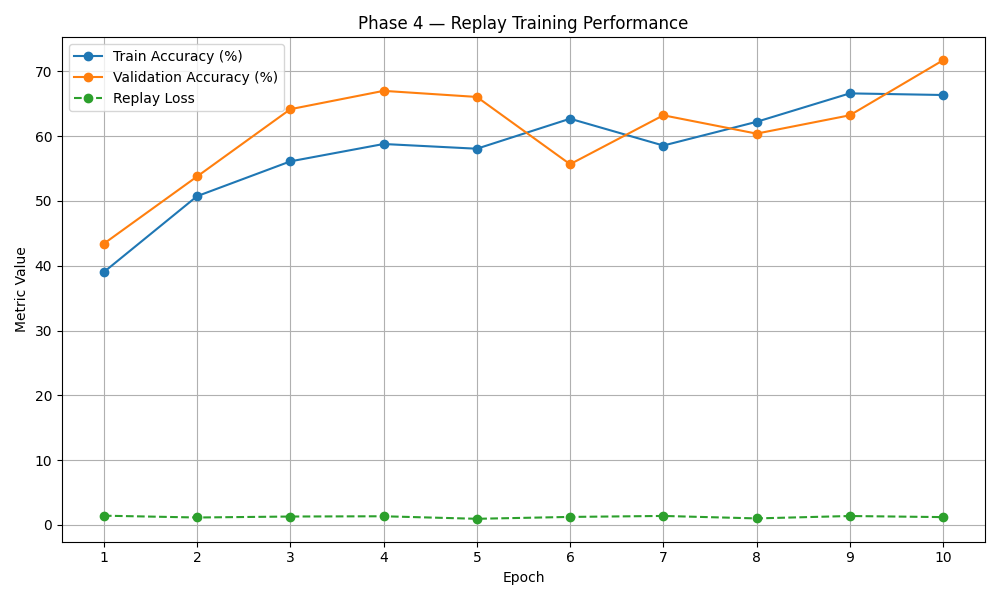

# 🏗️ AI Building Classifier

This project is a from-scratch convolutional neural network built using PyTorch to classify architectural images. The model begins with simple binary classification (e.g., **residential** vs **industrial**) and is evolving toward a full **multi-class architecture recognition system**, including both **cultural origins** (e.g., Egyptian, Chinese, Greek) and **stylistic classifications** (e.g., Renaissance, Baroque).

What makes this project different is that it mirrors **how humans learn** — through *meaningful memory*. The model saves the most significant examples from each training run (best and worst) and reuses them during future training to simulate a kind of **learning memory**. This concept is known in machine learning as *replay buffering* or *exemplar memory*, but it was developed here from a natural human insight.

---

## 🚀 Features Implemented

- [x] CNN model built from scratch in PyTorch
- [x] DuckDuckGo image scraping with multi-query support
- [x] Training and validation dataset pipeline
- [x] Memory replay buffer (save most & least accurate samples)
- [x] Resume training with memory-injected batches
- [x] Binary classifier (residential vs industrial)
- [x] Multi-class cultural classifier (Chinese, Egyptian, European, Greek, Indian)

---

## 🧠 Conceptual Design

Rather than just train on more and more data, this model is designed to **remember what mattered**. Each epoch, it saves the 10 most confidently correct and 10 most confusing samples. These are injected into future training runs, ensuring that the model is learning **not just more, but better**.

This concept is based on how humans often return to defining moments in our learning journeys — both successes and failures — to anchor deeper understanding.

---

## 🛣️ Roadmap

### ✅ Phase 1 — Binary Classification
- Residential vs Industrial buildings using scraped data

### ✅ Phase 2 — Multi-Class Cultural Classification
- Categories like: Egyptian, Chinese, Greek, Indian, European
- Replay buffer extended to multi-class scenario
- Achieved ~79% accuracy on validation

### 🔜 Phase 3 — Fine-Grained Architectural Style Classification
- Classify architectural **styles** within cultural categories
- Examples: Renaissance, Baroque, Gothic, Brutalist, Neoclassical

### 🔮 Phase 4 — Self-Improving Memory Loop
- Use replay memory to auto-refine misclassifications
- Incorporate knowledge-based reasoning and image similarity
- Move closer to human-like adaptive learning

---

## 📂 Project Structure

```
AI_Building_Classifier/
├── Data/               
│   ├── Raw/                   # Raw scraped images
│   ├── Training/              # Structured train/val folders
│   ├── Val/                   # Structured train/val folders
├── models/                    # Saved model checkpoints
├── replay_buffer/             # Stored key images from past runs
├── model.py                   # CNN architecture
├── train.py                   # Basic training loop
├── replay_train.py            # Training with replay buffer
├── replay_multiclass_train.py # Multi-class training with memory
├── evaluate.py                # Model evaluation script
├── download_image_cultures.py # Image scraper for cultural classes
├── dataset_splitter.py        # Train/val image sorter
└── JOURNAL.md                 # Thought log and original ideas
```

---

## 📉 Training Loss Over Time


---

## 📊 Multi-Class Validation Results (Phase 2)

| Class     | Precision | Recall | F1-score |
|-----------|-----------|--------|----------|
| Chinese   | 0.94      | 0.78   | 0.85     |
| Egyptian  | 0.74      | 0.86   | 0.80     |
| European  | 0.70      | 0.77   | 0.73     |
| Greek     | 0.91      | 0.83   | 0.87     |
| Indian    | 0.70      | 0.69   | 0.70     |
| **Avg**   | **0.80**  | **0.79** | **0.79** |

---

## ♻️ Phase 4 — Replay-Based Self-Improvement

The model now incorporates a **replay refinement loop**, where it:
- Logs predictions on the validation set during training.
- Extracts high-confidence correct (`focus`) and high-confidence incorrect (`reinforce`) samples.
- Re-injects these samples during future training to focus on meaningful mistakes and strengths.

This mimics how humans review both best and worst examples to deepen understanding.

### 🧠 Replay Training Curve

| Epoch | Train Acc | Val Acc | Replay Loss |
|-------|-----------|---------|-------------|
| 1     | 39.02%    | 43.40%  | 1.43        |
| 2     | 50.73%    | 53.77%  | 1.15        |
| 3     | 56.10%    | 64.15%  | 1.30        |
| 4     | 58.78%    | 66.98%  | 1.34        |
| 5     | 58.05%    | 66.04%  | 0.95        |
| 6     | 62.68%    | 55.66%  | 1.24        |
| 7     | 58.54%    | 63.21%  | 1.39        |
| 8     | 62.20%    | 60.38%  | 1.01        |
| 9     | 66.59%    | 63.21%  | 1.38        |
| 10    | 66.34%    | 71.70%  | 1.21        |

### 📈 Replay + Focus Training Plot



> 📝 Logs and plots are stored under `/checkpoints/` and `/plots/`. Replay samples in `/replay/`. See `Journal.md` for full self-training idea flow.

---

## 🧾 License & Attribution

## License

This project is currently released under a **source-available, non-commercial license**.

You are free to:
- View, learn from, and experiment with the code for **personal or educational use**.

You may **not**:
- Use this project or its derivatives for **commercial purposes** (including SaaS, resale, client work, or monetized tools).

A future license may allow commercial usage under specific conditions.

See [LICENSE.md](./LICENSE.md) for full details.

Some code co-developed with the help of ChatGPT-5.1.
